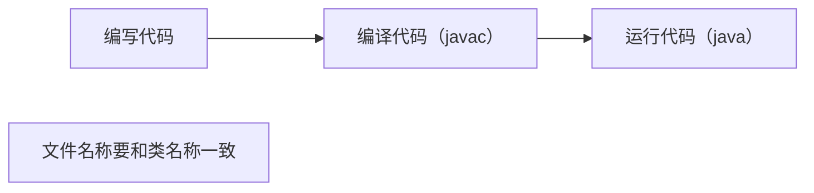
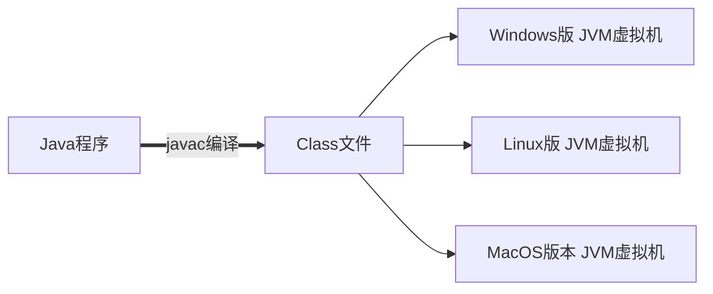

# Java基础


## 1. 背景知识

### 创始人

- 詹姆斯·高斯林

### 历史

- 1995年Sun公司
- 2009年Oracle公司

### 应用

- 桌面应用开发
- 企业级应用开发
- 移动应用开发
- 服务器系统
- 大数据开发
- 游戏开发

### Java技术体系

- Java SE：标准版
- JavaEE：企业版
- JavaME：小型版

### 问题

## 2. 快速入门


### JDK下载安装

- 官网：https://www.oracle.com/java/technologies/

- 环境变量配置

  - 方法一：在系统环境变量的Path里面配置JDK安装的BIN的完整目录

    如：D:abc\jdk-17.0.32\bin

  - 方法二：系统环境变量里先配置JAVA_HOME

    变量名为：`JAVA_HOME`

    变量值为：`D:abc\jdk-17.0.32`

    然后再Path里面配置`%JAVA_HOME%\bin`

### cmd常见命令

- JDK查看编工具和运行工具版本号的命令：`javac -version` 和 `java -version`

  guage-bash

  ```bash
  010203040506E: //切换到E盘
  cd [目录] //进入指定的目录
  cd .. //退回到上一级目录
  cd / //退回到根目录
  dir //显示当前目录下所有的内容
  cls //清空屏幕
  ```

### Java程序编程的3个步骤

guage-mermaid



### JDK的组成

1. JVM：Java虚拟机，真正运行Java程序的地方
2. 核心类库：Java自己写好的程序，给程序员自己的程序进行调用的
3. JRE：Java的运行环境
4. JDK：Java开发工具包（上面的所有）

### javadoc命令

- 文档注释是一种特殊的注释格式，用于为 Java 程序中的类、方法、字段等元素提供文档说明。文档注释以 /** 开始，以 */ 结束，可以包含多行描述性文本和标记

- 文档注释是一种标准的注释格式，在使用工具生成 API 文档时可以被提取出来，用于生成详细的程序文档。它们提供了对代码的解释、使用示例、参数说明、返回值说明等重要信息，帮助其他开发者理解和使用代码

- | 标签         | 作用                                                   |
  | ------------ | ------------------------------------------------------ |
  | @author      | 标识一个类的作者                                       |
  | @param       | 方法的参数                                             |
  | @return      | 标明返回值类型，一般用于方法注释，不能出现在构造方法中 |
  | {@value}     | 显示常量的值，该常量必须是 static 属性                 |
  | @since       | 版本号，标明从哪个版本起开始有这个函数                 |
  | @version     | 指定类的版本                                           |
  | @exception   | 可能抛出异常的说明，一般用于方法注释                   |
  | @throws      | 也是可能抛出异常的说明                                 |
  | @serial      | 说明一个序列化属性                                     |
  | @serialData  | 说明通过 writeObject() 和 writeExternal() 方法写的数据 |
  | @serialField | 说明一个 ObjectStreamField 组件                        |

- javadoc 命令语法格式如下：

  guage-bash

  ```bash
  01 javadoc [options] [packagenames][sourcefiles] 
  ```

  格式说明：
  （1）options 表示 javadoc 命令的选项；
  （2）packagenames 表示包名；
  （3）sourcefiles 表示源文件名。

### Java跨平台原理

跨平台性的原理是因为在不同版本的操作系统中安装有不同版本的Java虚拟机，Java程序的运行只依赖于Java虚拟机，和操作系统并没有直接关系。从而做到一处编译，处处运行。

guage-mermaid



## 3. Java基础语法


### 注释


```java
.单行注释：
	// 后面根解释文字
2.多行注释
	/*
		这里写注释文字
		可以写多行
	*/
3.文档注释
	/**
		这里写文档注释
		也可以写多行，文档注释可以利用JDK的工具生成帮助文档
	*/
```

### 字面量

| 常用数据 | 生活中的写法 | 程序中的写法 | 说明                                   |
| -------- | ------------ | ------------ | -------------------------------------- |
| 整数     | 666，-88     | 666，-88,0   | 写法一致                               |
| 小数     | 13.14，-5.21 | 13.14，-5.21 | 写法一致                               |
| 字符     | A,0,我       | ‘A’,‘0’，'我 | 程序中必须使用单引号，有且仅能一个字符 |
| 字符串   | 开发喵       | “开发喵”,“0” | 程序中必须使用双引号，内容可有可无     |
| 布尔值   | 真，假       | true\false   | 只有两个值，true表示真，false表示假    |
| 空值     |              | 值是null     | 一个特殊的值，空值                     |

### 变量

```
数据类型 变量名称 = 初始值;
```

### 标识符

1. 标识符由字母（ A~Z 和 a~z ）、数字（0~9）、下划线（_）、美元符号（$）以及部分Unicode字符集（各符号之间没有空格）组成。
2. 标识符的首字母以字母、下划线或美元符号开头，后面可以是任何字母、数字、美元符号或下划线，但不能以数字开头。
3. 标识符的命名不能是关键字、布尔值（true、false）和null。
4. 标识符区分大小写，没有长度限制。

### 关键字

| **abstract** | **default** | **if**         | **protected**    | **throws**    |
| ------------ | ----------- | -------------- | ---------------- | ------------- |
| **assert**   | **do**      | **implements** | **public**       | **transient** |
| **boolean**  | **double**  | **import**     | **return**       | **try**       |
| **break**    | **else**    | **instanceof** | **strictfp**     | **void**      |
| **byte**     | **enum**    | **int**        | **short**        | **volatile**  |
| **case**     | **extends** | **interface**  | **static**       | **while**     |
| **catch**    | **final**   | **long**       | **super**        | **_**         |
| **char**     | **finally** | **native**     | **switch**       |               |
| **class**    | **float**   | **new**        | **synchronized** |               |
| **const**    | **for**     | **package**    | **this**         |               |
| **continue** | **goto**    | **private**    | **throw**        |               |

### 数据类型转换

- 自动类型转换（扩展原始转换）

  guage-mermaid

  ```mermaid
  flowchart LR
      byte --> short --> int --> long --> float --> double
      		char --> int
  ```

  > 多种数据类型参与运算，其结果以大的数据类型为准
  > `byte`,`short`,`char` 三种类型数据在和其他类型数据运算时，都会转换为`int`类型再运算

- 强制类型转换（缩小原始转换）

  `目标数据类型 变量名 = (目标数据类型)被转换的数据;`

  ```java
  0102int a = 10;
  byte b = (byte)a;
  ```

```java
public class TypeConversionDemo3 {
	public static void main(String[] args) {
		// 目标：掌握强制类型转换。
		int a = 20;
		byte b = (byte) a;
		System.out.println(a);
		System.out.println(b);
        
		int i = 1500;
		byte j = (byte) i;
		System.out.println(j);
        
		double d = 99.5;
		int m = (int) d; // 强制类型转换
		System.out.println(m); // 丢掉小数部分，保留整数部分
	}
}
```

### 字符在计算机中的存储原理

> ASCII编码表中字符编码的规律：
>
> 1. 1.字符0对应48，后面的1,2,3,4…9 对应的十进制整数依次往后顺延
> 2. 2.字符a对应97，后面的b,c,d,e…z 对应的十进制整数依次往后顺延
> 3. 3.字符A对应65，后面的B,C,D,E…Z 对应的十进制整数依次往后顺延


