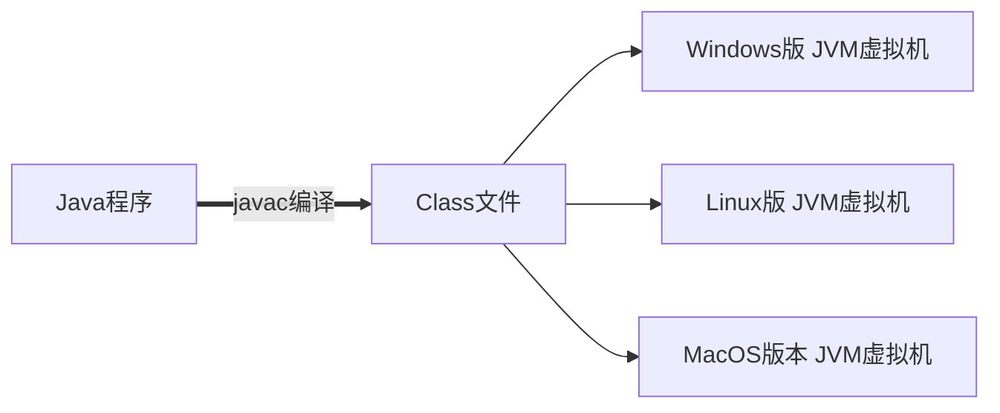

# Java基础


## 1. 背景知识

### 创始人

- 詹姆斯·高斯林

  

### 历史

- 1995年Sun公司
- 2009年Oracle公司

### 应用

- 桌面应用开发：能够在电脑桌面运行的软件 

  > 举例：财务管理软件、编写程序用的IDEA开发工具等，可以用Java语言开发 

- 企业级应用开发：大型的互联网应用程序 

  > 举例：淘宝、京东等

- 移动应用开发：运行的Android手机端的软件 

  > 举例：QQ客户端、抖音APP等

- 服务器系统：应用程序的后台（为客户端程序提供数据） 

  > 举例：服务器系统为用户推荐那你喜爱的视频 

- 大数据开发：大数据是一个互联网开发方向

- 游戏开发：游戏本质上是给用户提供娱乐的软件，有良好的交互感受

  >  举例：我的世界MineCraft就是用Java语言开发

### Java技术体系

- Java SE：标准版
- JavaEE：企业版
- JavaME：微缩、小型版

## 2. 快速入门

### JDK下载安装

- 官网：https://www.oracle.com/java/technologies/

  

- 环境变量配置

  - 方法一：在系统环境变量的Path里面配置JDK安装的BIN的完整目录

    如：D:abc\jdk-17.0.32\bin

  - 方法二：系统环境变量里先配置JAVA_HOME

    变量名为：`JAVA_HOME`

    变量值为：`D:abc\jdk-17.0.32`

    然后再Path里面配置`%JAVA_HOME%\bin`

### cmd常见命令

- JDK查看编工具和运行工具版本号的命令：`javac -version` 和 `java -version`

  guage-bash

  ```bash
  010203040506E: //切换到E盘
  cd [目录] //进入指定的目录
  cd .. //退回到上一级目录
  cd / //退回到根目录
  dir //显示当前目录下所有的内容
  cls //清空屏幕
  ```

### Java程序编程的3个步骤


> 文件名称要和类名称一致

### JDK的组成

1. JVM：Java虚拟机，真正运行Java程序的地方
2. 核心类库：Java自己写好的程序，给程序员自己的程序进行调用的
3. JRE：Java的运行环境
4. JDK：Java开发工具包（上面的所有）

### javadoc命令

- 文档注释是一种特殊的注释格式，用于为 Java 程序中的类、方法、字段等元素提供文档说明。文档注释以 /** 开始，以 */ 结束，可以包含多行描述性文本和标记

- 文档注释是一种标准的注释格式，在使用工具生成 API 文档时可以被提取出来，用于生成详细的程序文档。它们提供了对代码的解释、使用示例、参数说明、返回值说明等重要信息，帮助其他开发者理解和使用代码

- | 标签         | 作用                                                   |
  | ------------ | ------------------------------------------------------ |
  | @author      | 标识一个类的作者                                       |
  | @param       | 方法的参数                                             |
  | @return      | 标明返回值类型，一般用于方法注释，不能出现在构造方法中 |
  | {@value}     | 显示常量的值，该常量必须是 static 属性                 |
  | @since       | 版本号，标明从哪个版本起开始有这个函数                 |
  | @version     | 指定类的版本                                           |
  | @exception   | 可能抛出异常的说明，一般用于方法注释                   |
  | @throws      | 也是可能抛出异常的说明                                 |
  | @serial      | 说明一个序列化属性                                     |
  | @serialData  | 说明通过 writeObject() 和 writeExternal() 方法写的数据 |
  | @serialField | 说明一个 ObjectStreamField 组件                        |

- javadoc 命令语法格式如下：

  guage-bash

  ```bash
  01 javadoc [options] [packagenames][sourcefiles] 
  ```

  格式说明：
  （1）options 表示 javadoc 命令的选项；
  （2）packagenames 表示包名；
  （3）sourcefiles 表示源文件名。

### Java跨平台原理

跨平台性的原理是因为在不同版本的操作系统中安装有不同版本的Java虚拟机，Java程序的运行只依赖于Java虚拟机，和操作系统并没有直接关系。从而做到一处编译，处处运行。



### java的编译与反编译、运行

#### `Javac`是编译命令，用于将Java源文件编译成Java字节码文件。


#### `Java`是解释器命令，用于执行字节码文件


#### `Javap`是编译命令，用于反编译


