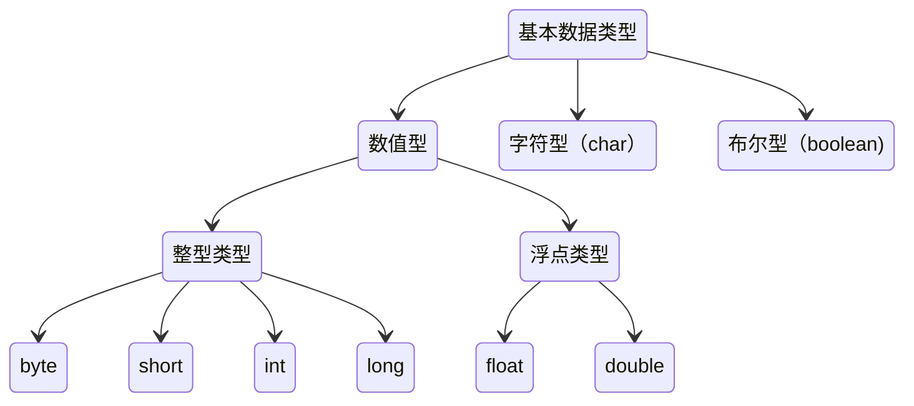
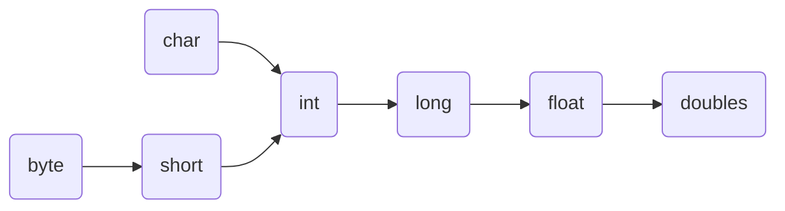

## 基本数据类型

> 基本数据类型一共有8种

### 常量

是指在程序运行期间值不能改变的量

### 变量

是指在程序运行期间可以改变的量。定义变量的目的是为了在程序运行期间存储数据。定义变量的本质是向`JVM`申请内存，以临时存放数据。定义变量的语法格式如下：

​	**[修饰符] 变量类型 变量名 [= 初始值]**

> 变量类型指定了变量可以存储的数据类型。它可以是基本数据类型和引用数据类型。变量类型决定了变量在内存中占用的空间和可以执行的操作。
>
> 变量名是用来标识变量的名称，它必须遵循一定的命名规则。变量名应该具有描述性，以便代码可读性更强。
>
> []中的内容表示可选项
>
> = 初始值
>
> 变量必须先定义，再使用

## 引用数据类型

引用数据类型包括类、接口、数组、枚举、字符串属于引用数据类型。

>提示:基本数据类型定义的变量中存储的是真实数据,引用类型定义的变量中存储的是地址.

## 基本数据类型间的转换

### 算数运算

不同类型的操作数，首先自动转换为表达式中最高级别的数据类型，然后进行计算，运算的结果是最高级别的数据类型，简称低级别自动转换为高级别。

### 赋值运算

赋值运算时，数据转换有两种类型`自动类型转换`、`强制类型转换`。

#### 拓展原始转换

在原始类型之间进行特定转换（当将低级别类型的值赋值给高级别类型）时，称为拓展原始转换。拓展原始类型会进行自动类型转换。

> 低级别类型的表示范围更小，而高级别类型的表示范围更大。
>
> 因此低级别类型的值转换为高级别的值是安全的，不会导致数据丢失。

#### 缩小原始转换

在原始类型之间进行特定转换（当将高级别类型的值赋值给低级级别类型）时，称为缩小原始转换。

> 高级别转换为低级别类型可能会导致数据丢失。
>
> 缩小原始转换必须使用强制类型转换。

